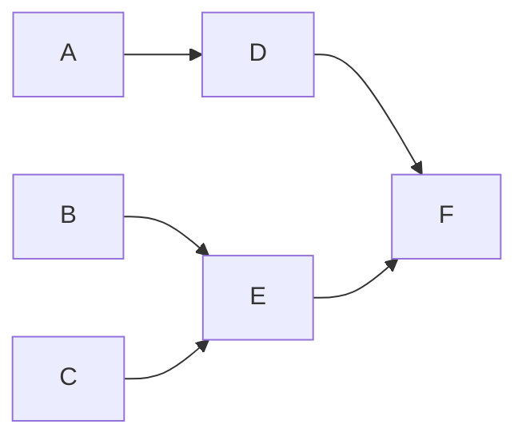

# Görev Planlama ve Sıralama Sistemi

## İçindekiler
- [Genel Bakış](#genel-bakış)
- [Sistem Mimarisi](#sistem-mimarisi)
- [Algoritma Adımları](#algoritma-adımları)
- [Kullanım](#kullanım)
- [Test Senaryoları](#test-senaryoları)
- [Teknik Detaylar](#teknik-detaylar)
- [Algoritma Notları](#algoritma-notları)
- [Gelecek Geliştirmeler](#gelecek-geliştirmeler)

## Genel Bakış
Bu proje, görevler arasındaki bağımlılıkları dikkate alarak optimum görev sıralaması ve toplam tamamlanma süresini hesaplayan bir sistemdir. Kahn'ın topolojik sıralama algoritması kullanılarak geliştirilmiştir.

## Sistem Mimarisi

### Veri Toplama Modülü
- collect_task_names(): Görev isimlerini alır
- collect_task_dependencies(): Görev bağımlılıklarını alır
- collect_task_durations(): Tamamlanma sürelerini alır

### Hesaplama Motoru
#### Graf Yapısı
- Görevler arası bağımlılıklar yönlendirilmiş çizge (directed graph) ile modellenir
- Her görev bir düğüm (node) olarak temsil edilir
- Bağımlılıklar kenarlar (edges) ile gösterilir

#### Topolojik Sıralama
- Döngüsel olmayan yönlü graf (DAG) üzerinde sıralama yapılır
- Kahn algoritması kullanılarak optimum görev sırası belirlenir
- Bağımlılıkların tutarlılığı kontrol edilir

#### Bağımlılık Yönetimi
- Her görev için giriş derecesi (in-degree) hesaplanır
- Giriş derecesi sıfır olan görevler hazır durumda kabul edilir
- Tamamlanan görevlerin bağımlı olduğu görevlerin giriş dereceleri güncellenir

#### İşlem Sırası
- Hazır görevler kuyruk (queue) yapısında tutulur
- FIFO (First In First Out) prensibiyle işlenir
- Yeni hazır olan görevler kuyruğa eklenir

## Algoritma Adımları

### 1. Görev İsimleri Toplama
- Kullanıcıdan görev isimleri tek tek alınır
- Boş satır girilene kadar giriş devam eder
- Tüm görevler bir listede toplanır

### 2. Bağımlılık Bilgisi Toplama
- Her görev için bağımlılıklar virgülle ayrılarak alınır
- Bağımlılıklar bir sözlük yapısında saklanır
- Her görevin hangi görevlerden sonra yapılacağı belirlenir

### 3. Süre Bilgisi Toplama
- Her görev için tamamlanma süresi alınır
- Sadece pozitif sayılar kabul edilir
- Geçersiz girişlerde (negatif sayı/harf) hata mesajı gösterilir

### 4. Optimum Sıralama Hesaplama
- Bağımlılıklar graf yapısında temsil edilir
- Bağımsız görevler kuyruğa eklenir
- Görevler sırayla işlenir
- Tamamlanan görevlerin bağımlıları güncellenir
- Minimum tamamlanma süresi hesaplanır

## Kullanım

### Örnek Senaryo
```
İş: J
Görevler: A, B, C, D, E, F
```

#### Bağımlılık İlişkileri
- A, B, C: Bağımsız görevler
- D → A: D görevi A'ya bağımlı
- E → B,C: E görevi B ve C'ye bağımlı
- F → D,E: F görevi D ve E'ye bağımlı

#### Görev Süreleri
| Görev | Süre (birim) |
|-------|--------------|
| A     | 3           |
| B     | 2           |
| C     | 4           |
| D     | 5           |
| E     | 2           |
| F     | 3           |

#### Bağımlılık Grafiği


#### Sonuç
- Yürütme sırası: [A, B, C, D, E, F]
- Minimum süre: 19 birim

## Algoritma Notları

### Sıralama Yaklaşımları
1. Bağımsız Görev Önceliği
   - Bağımsız görevler önce tamamlanır
   - Bağımlı görevlerin süreleri güncellenir
   - Yeni bağımsız görevler sıraya alınır

2. Toplam Süre Bazlı (Alternatif Yaklaşım)
   - Her görevin toplam çalışma süresi hesaplanır
   - Bağımlılık süreleri + kendi süresi
   - Küçükten büyüğe göre sıralama yapılır

### Önemli Notlar
- Tek worker senaryosunda toplam süre: 19 birim
- Multi-worker (CPM) senaryosunda toplam süre: 11 birim
- Kritik yol (multi-worker): A-D-F

## Test Senaryoları

### Test Kapsamı
- Doğrusal bağımlılıklar
- Paralel görev yürütme
- Karmaşık bağımlılıklar
- Bağımsız görevler
- Elmas bağımlılık deseni
- Tekli görev senaryosu

### Testleri Çalıştırma
```bash
python -m unittest test_en_uygun_case.py
```

## Teknik Detaylar

### Algoritma Seçimi
Kahn'ın topolojik sıralama algoritması tercih edilmiştir:
- Döngüsel bağımlılık tespiti
- O(V + E) lineer zaman karmaşıklığı
- Bakımı kolay kod yapısı
- Sıralı işlem optimizasyonu

### Karmaşıklık Analizi
- V (Vertex): Toplam görev sayısı
- E (Edge): Toplam bağımlılık sayısı
- Zaman Karmaşıklığı: O(V + E)

## Gelecek Geliştirmeler

### Multi-Worker Desteği (CPM)
- Bağımsız görevlerin paralel çalıştırılması
- Kritik yol analizi
- Optimum kaynak kullanımı
- Toplam sürede önemli iyileştirme (19 → 11 birim)

### CPM (Critical Path Method) Entegrasyonu
Multi-worker sisteme geçiş için CPM özellikleri:
- Kritik yol analizi
- Görev zamanlaması optimizasyonu
- Slack time hesaplaması
- Paralel görev yönetimi

### Avantajları
- Worker kullanım optimizasyonu
- Optimal görev dağıtımı
- Toplam süre (makespan) minimizasyonu
- Verimli kaynak kullanımı

### Kaynaklar ve Referanslar
- [CPM (Critical Path Method) Detaylı Anlatım](https://www.youtube.com/watch?v=Xe-1O3g_ldU)

## Kullanım Alanları
- Proje yönetimi
- İş akışı planlaması
- Yazılım geliştirme süreçleri
- Üretim planlama
- Kaynak tahsisi

## İletişim
Email: ibrahimbayburtlu5@gmail.com