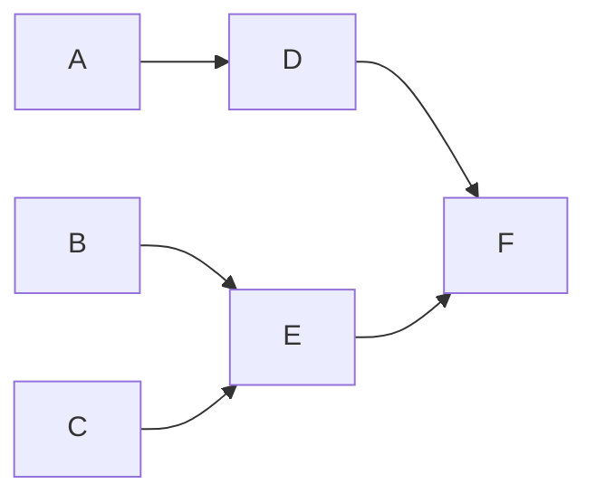

# Görev Planlama ve Sıralama Sistemi

## İçindekiler
- [Genel Bakış](#genel-bakış)
- [Sistem Mimarisi](#sistem-mimarisi)
- [Kullanım](#kullanım)
- [Test Senaryoları](#test-senaryoları)
- [Teknik Detaylar](#teknik-detaylar)
- [Gelecek Geliştirmeler](#gelecek-geliştirmeler)

## Genel Bakış
Bu proje, görevler arasındaki bağımlılıkları dikkate alarak optimum görev sıralaması ve toplam tamamlanma süresini hesaplayan bir sistemdir. Kahn'ın topolojik sıralama algoritması kullanılarak geliştirilmiştir.

## Sistem Mimarisi

### Veri Toplama Modülü
- **get_tasks_from_user()**: Görev isimlerini alır
- **get_dependencies_from_user()**: Görev bağımlılıklarını alır
- **get_completion_times()**: Tamamlanma sürelerini alır

### Hesaplama Motoru
- Yönlendirilmiş çizge (directed graph) tabanlı bağımlılık yönetimi
- Topolojik sıralama ile optimum görev sıralaması
- Giriş derecesi (in-degree) takibi
- Kuyruk (queue) yapısı ile görev yönetimi

## Kullanım

### Örnek Senaryo
```
İş: J
Görevler: A, B, C, D, E, F
```

#### Bağımlılık İlişkileri
- A, B, C: Bağımsız görevler
- D → A: D görevi A'ya bağımlı
- E → B,C: E görevi B ve C'ye bağımlı
- F → D,E: F görevi D ve E'ye bağımlı

#### Görev Süreleri
| Görev | Süre (birim) |
|-------|--------------|
| A     | 3           |
| B     | 2           |
| C     | 4           |
| D     | 5           |
| E     | 2           |
| F     | 3           |

#### Bağımlılık Grafiği


#### Sonuç
- **Yürütme sırası:** [A, B, C, D, E, F]
- **Minimum süre:** 19 birim

## Test Senaryoları

### Test Kapsamı
- Basit doğrusal görevler
- Paralel görevler
- Karmaşık bağımlılıklar
- Bağımlılık olmayan durumlar
- Doğrusal ve paralel yollar

### Testleri Çalıştırma
```bash
python -m unittest test_en_uygun_case.py
```

## Teknik Detaylar

### Algoritma Seçimi
Kahn'ın topolojik sıralama algoritması tercih edilmiştir:
- Döngüsel bağımlılık tespiti
- O(V + E) lineer zaman karmaşıklığı
- Bakımı kolay kod yapısı
- Sıralı işlem optimizasyonu

### Karmaşıklık Analizi
- V (Vertex): Toplam görev sayısı
- E (Edge): Toplam bağımlılık sayısı
- Zaman Karmaşıklığı: O(V + E)

## Gelecek Geliştirmeler

### CPM (Critical Path Method) Entegrasyonu
Multi-worker sisteme geçiş için CPM özellikleri:
- Kritik yol analizi
- Görev zamanlaması optimizasyonu
- Slack time hesaplaması
- Paralel görev yönetimi

### Avantajları
- Worker kullanım optimizasyonu
- Optimal görev dağıtımı
- Toplam süre (makespan) minimizasyonu
- Verimli kaynak kullanımı

### Kaynaklar ve Referanslar
- [CPM (Critical Path Method) Detaylı Anlatım](https://www.youtube.com/watch?v=Xe-1O3g_ldU) - CPM algoritmasının detaylı açıklaması ve örnek uygulamaları

## Kullanım Alanları
- Proje yönetimi
- İş akışı planlaması
- Yazılım geliştirme süreçleri
- Üretim planlama
- Kaynak tahsisi

## Lisans
[Lisans bilgisi eklenecek]

## İletişim
[İletişim bilgileri eklenecek]